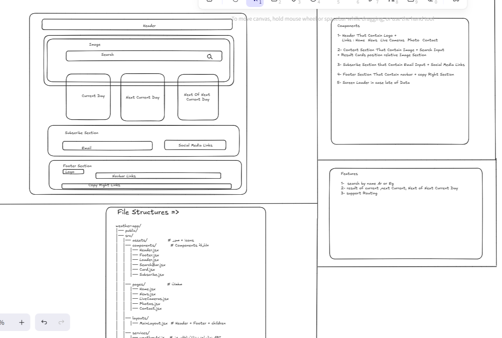
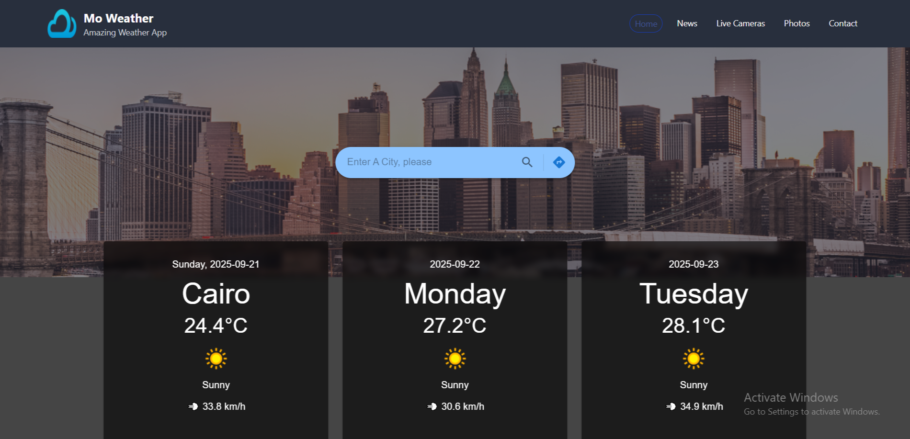
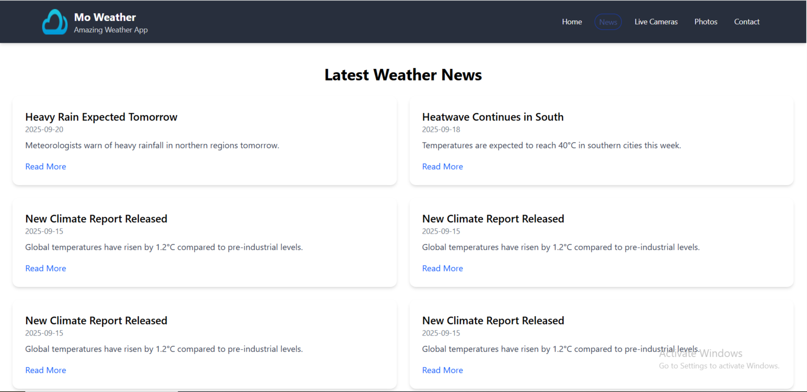
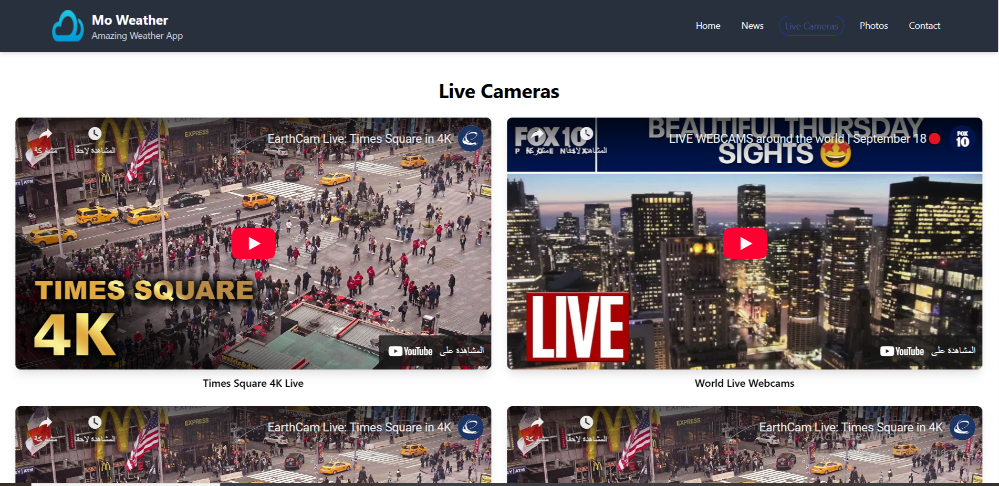
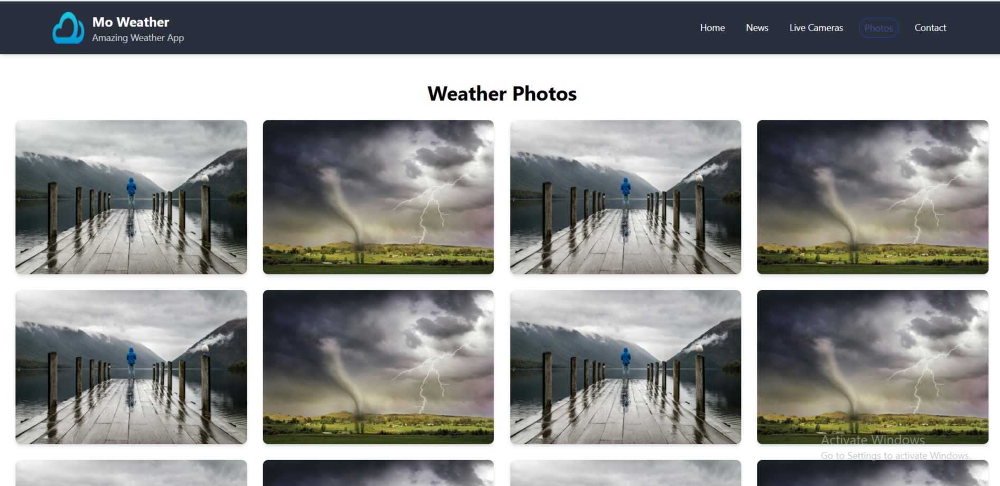
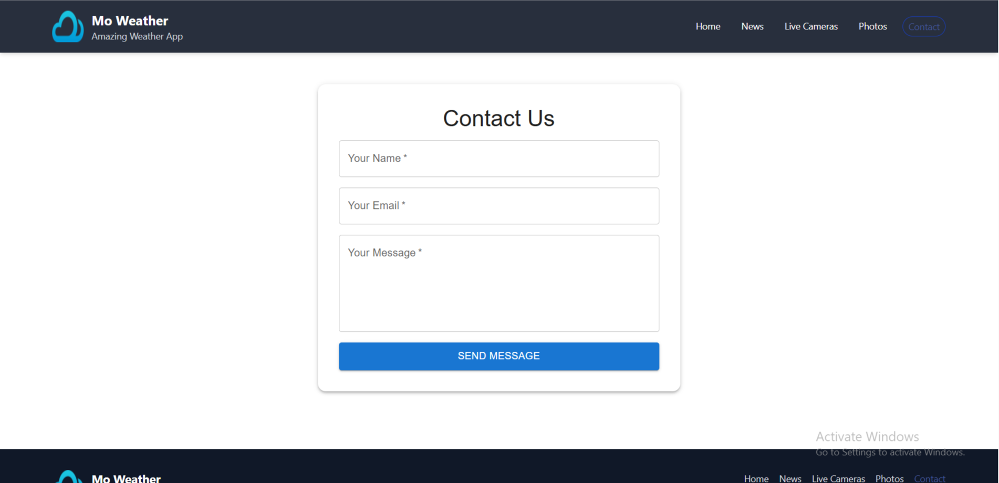
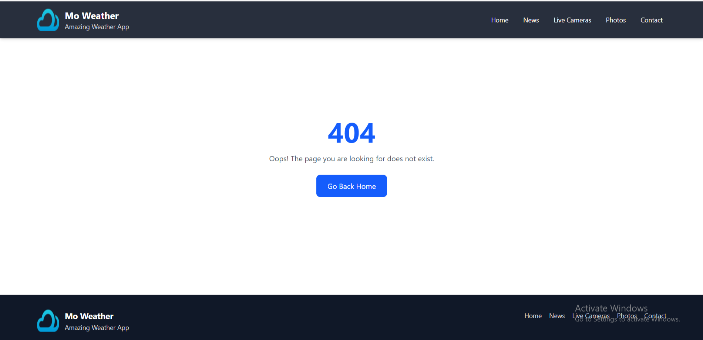

# MO Weather React App 🌤️

  

**Weather App** is an interactive React project that shows current weather and forecast for upcoming days, with a modern and user-friendly interface.

---

## 📝 Description

This app allows users to:
- Search for any city and display current weather + upcoming forecasts.
- View detailed weather information: date, city, day, weather condition, and wind speed.
- Watch live streams from weather-related cameras around the world.
- Browse a photo gallery representing different weather conditions.
- Read top news related to weather.
- Contact the site owner via a contact form.
- Handle 404 errors for invalid routes.

---

## 📂 Components

- **Home**: Main page with search and weather display.
- **News**: Display weather-related news (Static / Fake API).
- **LiveCameras**: Display live streams from cameras worldwide.
- **Photos**: Photo gallery representing weather conditions.
- **Contact**: Contact form for sending messages.
- **NotFound**: 404 page for invalid routes.
- **BasicCard**: Reusable card for displaying weather data.
- **Header & Footer**: Main layout components.
- **Loader**: Improves user experience while fetching data.

---

## ⚡ Features

- Dynamic city search with current weather and upcoming forecasts.
- Display detailed weather info (temperature, wind, condition, date, day, city).
- Loader for smooth UX during data fetching.
- Navigation with active link highlighting using **NavLink**.
- Additional pages: news, photos, live cameras, contact form.
- Centralized weather and city state management using **Context API**.
- Modern and responsive design with **Tailwind CSS** and **Material UI**.

---

## 🛠️ Tech Stack

- **Frontend**:
  - ReactJS
  - Tailwind CSS
  - Material UI
  - React Router (NavLink)
  - Context API
  - React Hooks: useState, useEffect, useContext, useRef
- **API**:
  - WeatherAPI (API calls separated into a dedicated file)
- **Deployment**:
  - vercel
- **Version Control**:
  - Git + GitHub

---
## Planing for Project

- **Planing Diagram**
  

---

## 🚀 Installation & Setup

Clone the repo and run the app locally:

##### Clone repo

```bash
git clone https://github.com/Mohamedsayed101/MO-Weather-React.git
```

##### Navigate to project folder

```bash
cd MO-Weather-React
```

##### Install dependencies

```bash
npm install
```

##### Start development server

```bash
npm run dev
```

---

## 🌐 Project Links

## ✨ Deployment
You can deploy the template easily using:
- [GitHub Pages](https://mohamedsayed101.github.io/MO-Weather-React/)  
- [vercel](https://mo-weather-react.vercel.app/)  

---

## 📸 Screenshots

- **Home Page**

  


- **News Page**

  


- **Live Cameras Page**

  


- **Photos Page**

  


- **Contact Page**

  


- **Not Found (404) Page**

  

---

---

## 🙏 Acknowledgements

Special thanks to **Engineer Yarab from Tarmmez Academy** for the excellent effort in explaining concepts, breaking down problems, and guiding us step by step. May Allah reward him greatly.  

And we ask Allah, the Most Merciful, to support and ease the suffering of our brothers and sisters in **Gaza** – to feed the hungry, give drink to the thirsty, and grant them relief and victory. ❤️

---

## 📧 Contact
Created with ❤️ by **[Mohamed Sayed]**  
Feel free to fork, customize, and share this template!
